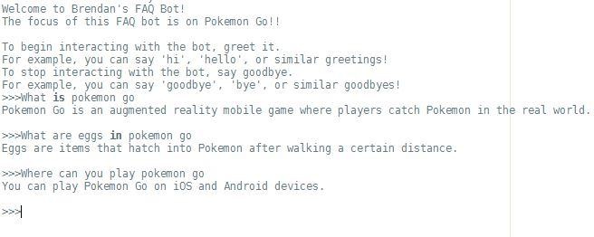

# FAQ-Bot

## Purpose
This is a basic starting point as I begin to understand the inner workings of NLP and ML.

## Features
- **Basic String Matching:** The bot makes use of basic string matching to compare the user's utterance (input) with a list of predefined questions (intents), and answers (responses).
- **Utterance Handling:** The utterance is cleaned by removing punctuation, extra spaces, non alphabetic characters, and converting the text to lowercase allowing for a more accurate comparison, reducing errors caused by varying text formats.
- **Intent Recognition:** The bot attempts to match the cleaned utterance with the list of predefined answers (responses) in order to determine the user's intent. If the bot understands the users intent, a match is found. Otherwise, a default response is provided.
- **Greeting and Goobyes:** The bot recognizes and responds to common/basic greetings and goodbyes (e.g., 'hi', 'hello'), allowing for a more natural conversation between the bot and the user.
- **JSON Data:** The lists of predefined questions (intents) and answers (responses) are stored in an external JSON file, making it easy to update or change the data.
- **Chat Loop:** The main function controlling the interactions between the user and the bot is created using a loop, simulating the continuous interaction between the bot and the user until the user has chosen to quit.

## How it Works (Using the Bot)
1. **User Input**:
  - The user will enter an utterance (input) into the bot.
2. **Cleaning:**
    - Before processing the utterance, the utterance itself is cleaned, meaning it is stripped of non alphabetic characters, punctuation, and extra spacing.
3. **Intent Matching:**
    - The cleaned utterance is compared to a list of predefined intents (questions).
    - The bot will attempt to find the best match between the user's utterance and the list of intents.
    - If a match is found, the bot identifies the intent associated with the question.
4. **Generating a Response:**
    - After the bot has identified the intent, it will generate a response based on the list of answers (responses).

## Example

